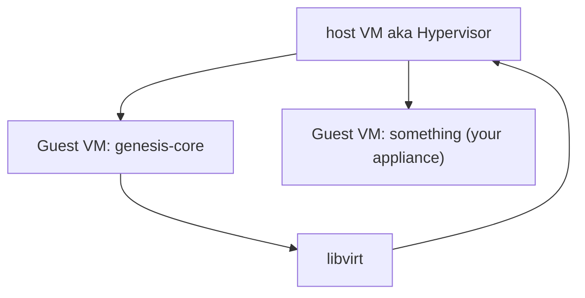

# Genesis-core developer stand all-in-one image

## How to use

- Get latest release [qcow2](https://github.com/infraguys/gci_dev_all_in_one/releases/latest/download/stand.qcow2.zip) or [vdi](https://github.com/infraguys/gci_dev_all_in_one/releases/latest/download/stand.vdi.zip) image
- Run it via your preferred virtualization software (VirtualBox, VMware, etc.), recommendations:
  - Linux: `virt-manager` or VirtualBox
  - Mac: VirtualBox
  - Windows: VirtualBox
- VM's default username/password is `ubuntu:ubuntu`
- Core API is available at http://VM_IP:11010
  - default API username/password is `admin:admin`
  - de-facto these requests are proxied to genesis-core VM (http://10.20.0.2:11010)
- inner genesis-core VM:
  - IP address: 10.20.0.2
  - default username/password is `ubuntu:ubuntu`

## Stand scheme



## Useful requests
```bash
VM_IP=10.20.0.2

# Get token
ADMIN_TOKEN=$(curl --location "http://$VM_IP:11010/v1/iam/clients/00000000-0000-0000-0000-000000000000/actions/get_token/invoke" \
    --header 'Content-Type: application/x-www-form-urlencoded' \
    --data-urlencode 'grant_type=password' \
    --data-urlencode 'username=admin' \
    --data-urlencode 'password=admin' \
    --data-urlencode 'client_id=GenesisCoreClientId' \
    --data-urlencode 'client_secret=GenesisCoreClientSecret' \
    --data-urlencode 'scope=' \
    --data-urlencode 'ttl=3600' | jq .access_token -r)

# Create node
curl --location "http://$VM_IP:11010/v1/nodes/" \
--header 'Content-Type: application/json' \
--header "Authorization: Bearer $ADMIN_TOKEN" \
--data '{
    "name": "test",
    "project_id": "00000000-0000-0000-0000-000000000000",
    "root_disk_size": 5,
    "cores": 1,
    "ram": 2048,
    "image": "http://repository.genesis-core.tech:8081/genesis-base.raw"
}'
```

## Build stand from scratch

You can easily build it by yourself, prerequisites:
- Packer
- Some packages: `qemu-system-amd64 qemu-kvm qemu-utils libvirt-daemon-system libvirt-dev mkisofs`
- `./build.sh`
